import StoryBlock from '../../../components/StoryBlock.astro';
import HorizontalBreak from '../../../components/HorizontalBreak.astro';  

<StoryBlock 
  section_name=""
  header="Timeline"
  description={`With an <strong> 10-week timeline </strong> to design and prototype the MVP, I strategically mapped out my workflows to stay on track.`}
>
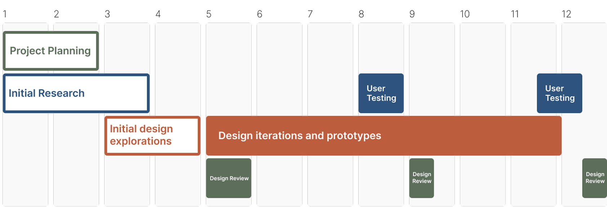
</StoryBlock>

<HorizontalBreak isDivider={true}/>

## To ensure clarity and efficiency from the start, I kicked off the project with research.

<StoryBlock 
  section_name="Background Research"
  header="Research Questions"
  description="I began by breaking the larger challenge into smaller, actionable pieces to keep the work manageable and focused."
>
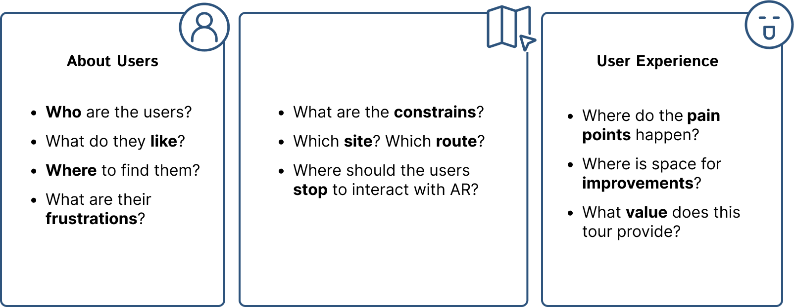
</StoryBlock>

<StoryBlock 
  section_name="Background Research"
  header="Desk Research"
  description="Understanding the market landscape was essential for building a relevant product, so I conducted competitive analysis through structured desk research, which led to a clear articulation of our unique value proposition."
>
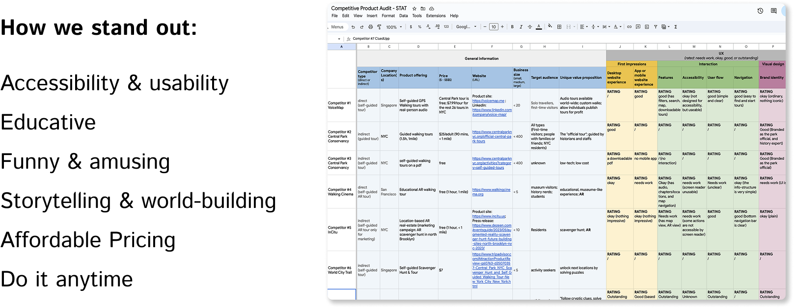
</StoryBlock>

<StoryBlock 
  section_name="Background Research"
  header="Field Research"
  description="Based on the design constrains, I narrowed ideas down to the following route, and annotated it on an interactive online map (Felt Map):"
> 
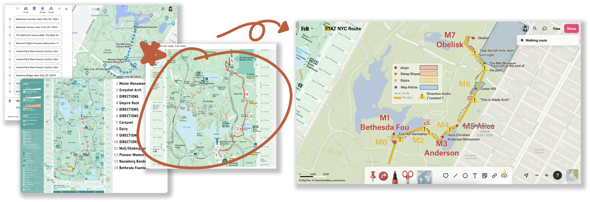
</StoryBlock>

## After shipping the product, I conduscted user research while doing usability testing.

<StoryBlock 
  section_name="Post-launch Research"
  header="User Research"
  description="To validate assumptions and uncover real user needs, I ran usability testing and user interviews. Insights from these sessions directly informed an updated set of user personas and clarified our future focus areas."
>
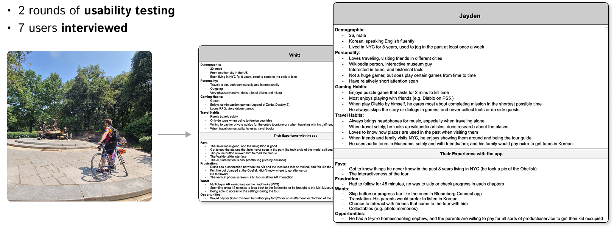
</StoryBlock>

## Design Process

<StoryBlock 
  section_name=""
  header="User Flow"
  description="I redefined the user flow to enhance navigation and improve overall ease of use."
>
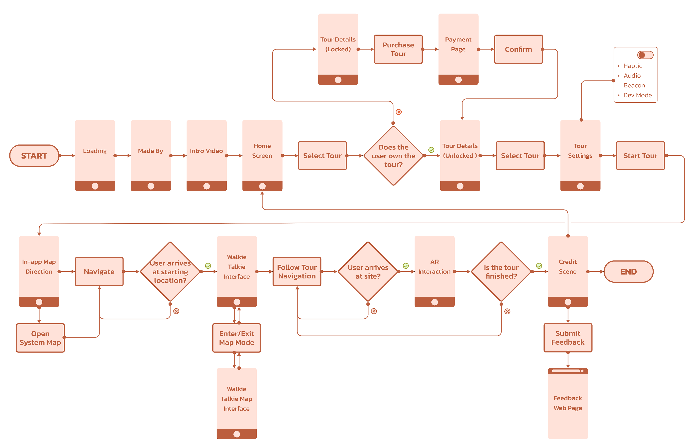
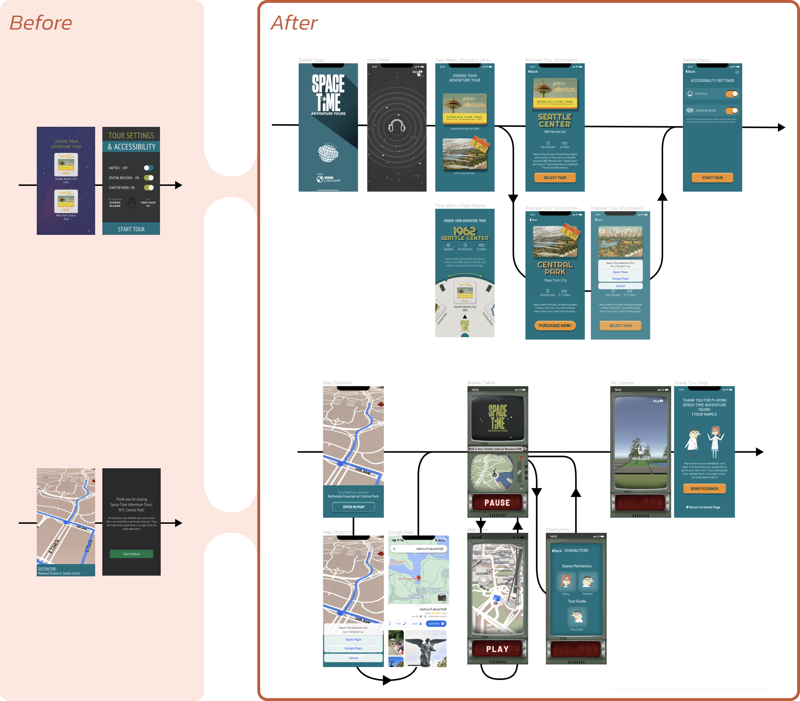
</StoryBlock>

<StoryBlock 
  section_name="Design Challenge"
  header="Design Immersive Way Finding"
  description=""
>
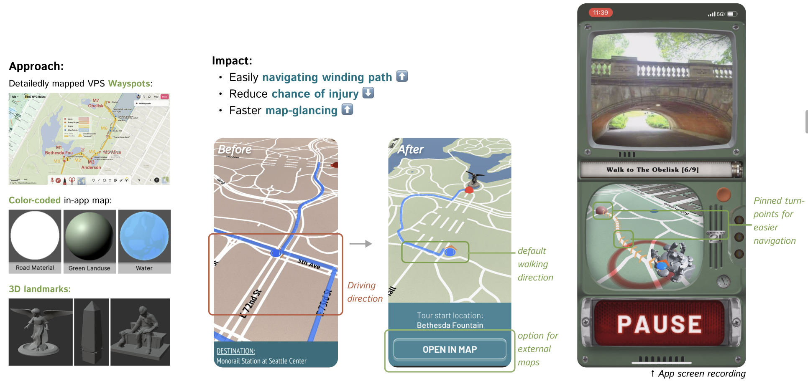
</StoryBlock>

<StoryBlock 
  section_name="Design Challenge"
  header="Design 3D Map Camera Control"
  description=""
>
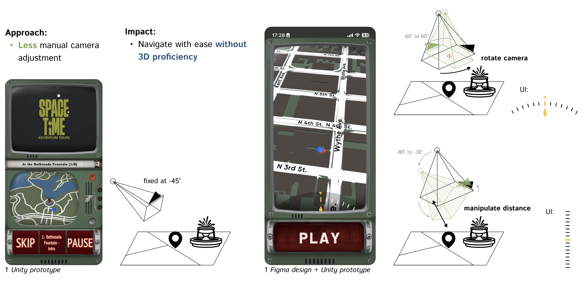
</StoryBlock>

<StoryBlock 
  section_name="Design Challenge"
  header="Design AR Placement Interaction"
  description=""
>
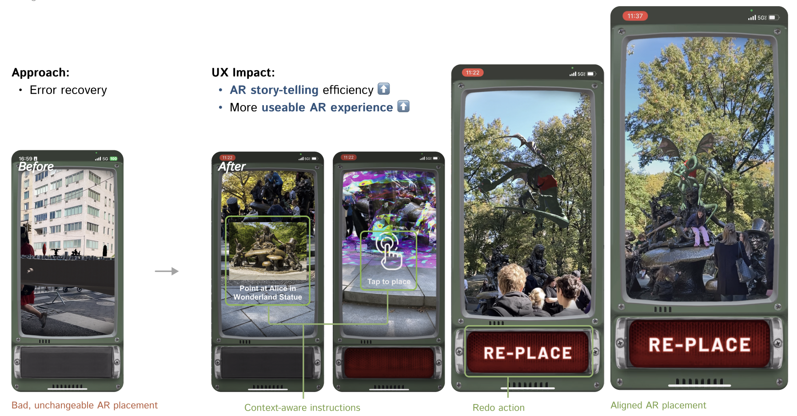
</StoryBlock>

<StoryBlock 
  section_name="Design Challenge"
  header="Accessibility Considerations"
  description=""
>
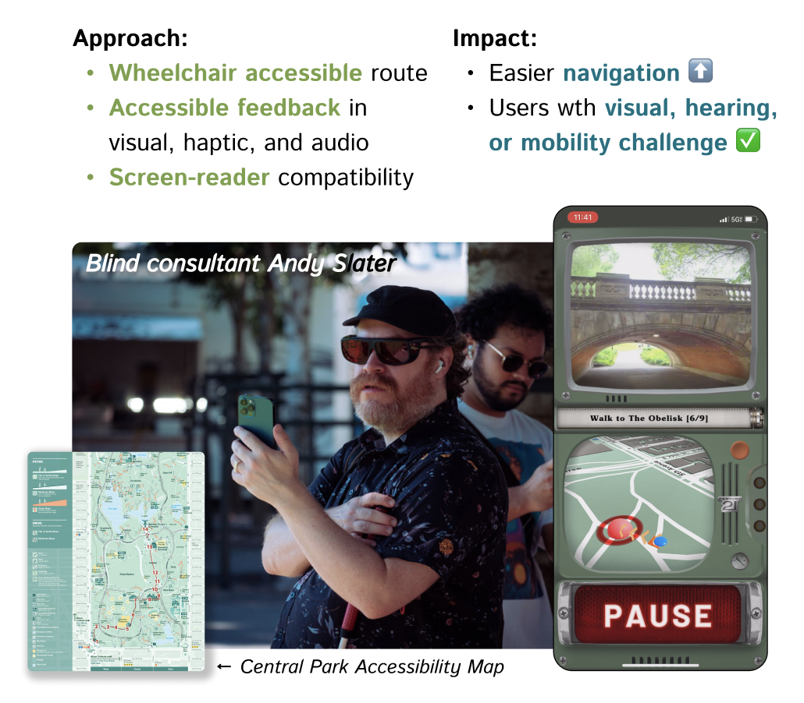
</StoryBlock>

## Deliverables

<StoryBlock 
  section_name=""
  header=""
  description=""
>
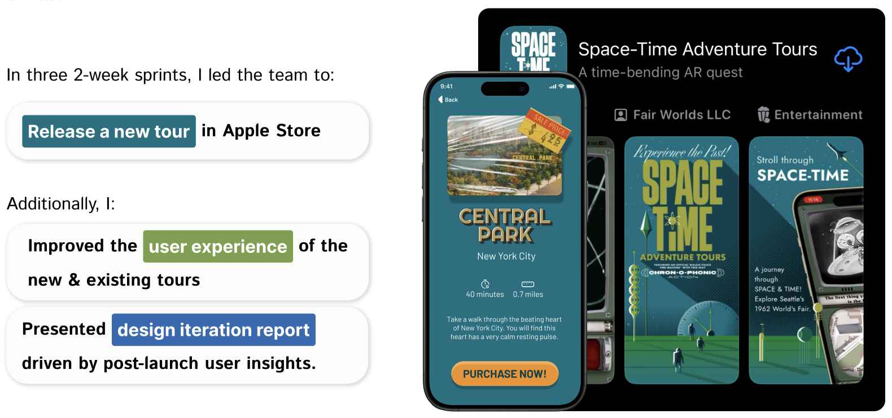
</StoryBlock>

<StoryBlock 
  section_name="Deliverables"
  header="UI Touch-up"
  description=""
>
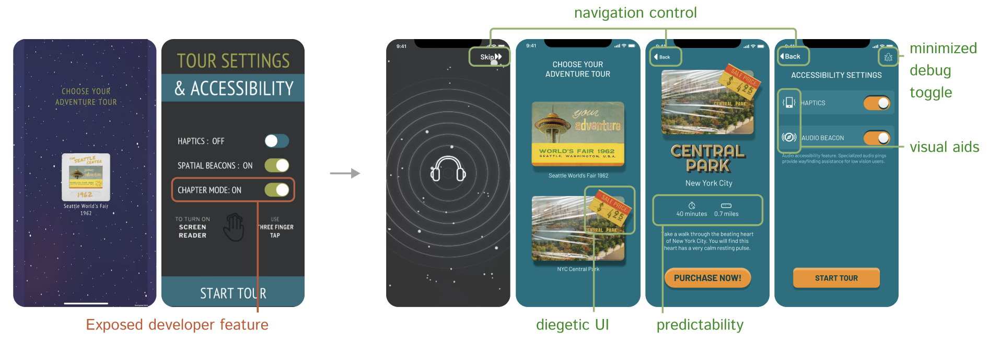
</StoryBlock>

<StoryBlock 
  section_name="Deliverables"
  header="App Store Release"
  description=""
>
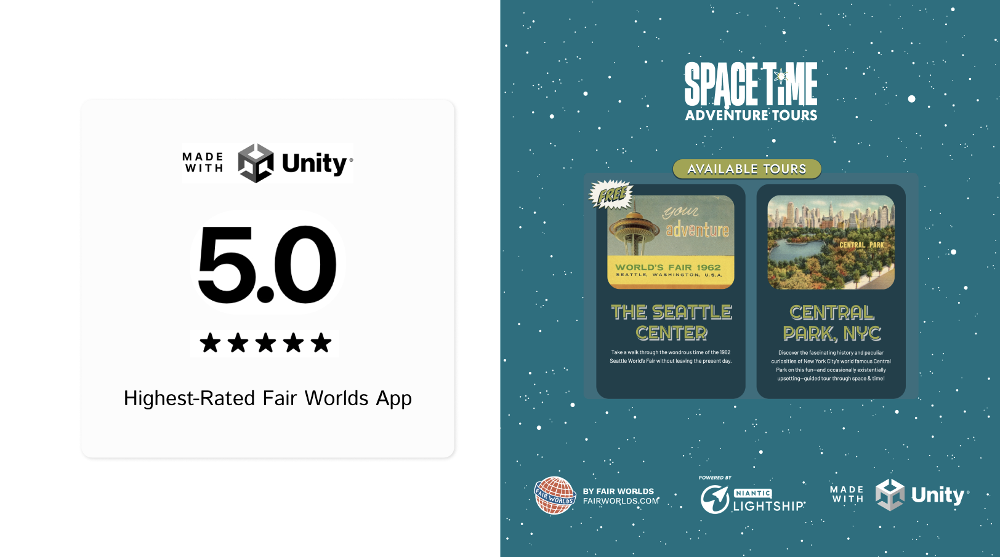
</StoryBlock>

## Learnings

<StoryBlock 
  section_name=""
  header="Non-Linear Design Is OK"
  description="At the beginning of this project, I felt stuck because the stakeholders didn't have a clear description of the users, even tho they had the idea in mind. Being pushed by the tight timeline, I had to start ideation and development without fully understanding the users. However, while testing the tour experience with multiple users, the desired user personas became more and more clear.
  My takeaway from this is that the design process can be flexible and non-linear, and talking to users is the best way to solve a problem."
>
</StoryBlock>

## 

