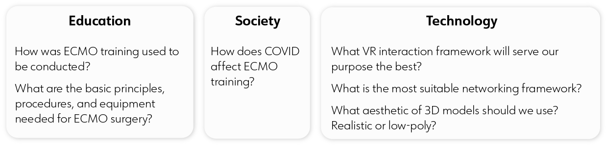
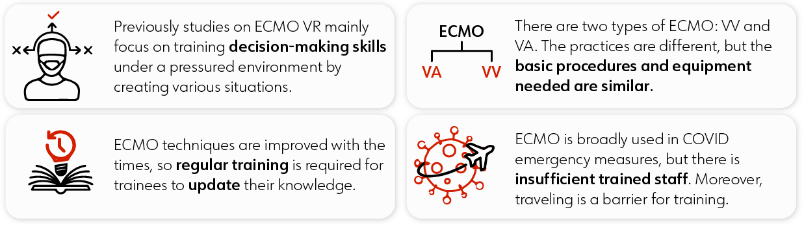
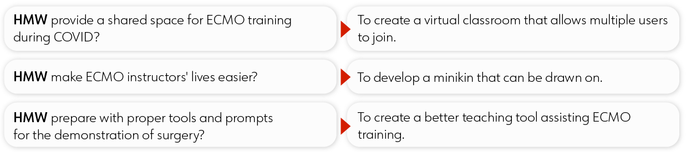
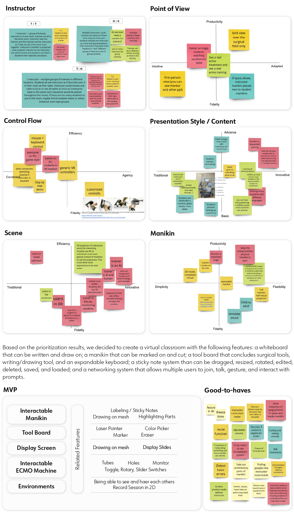
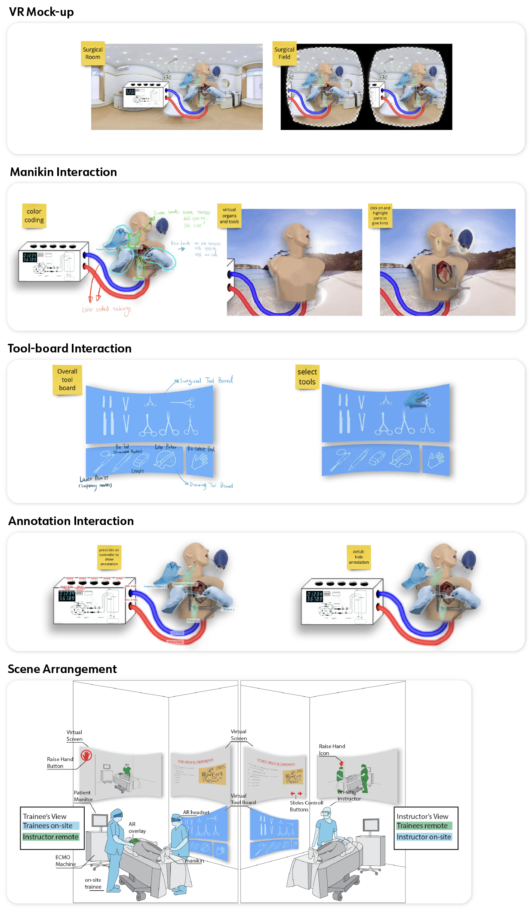
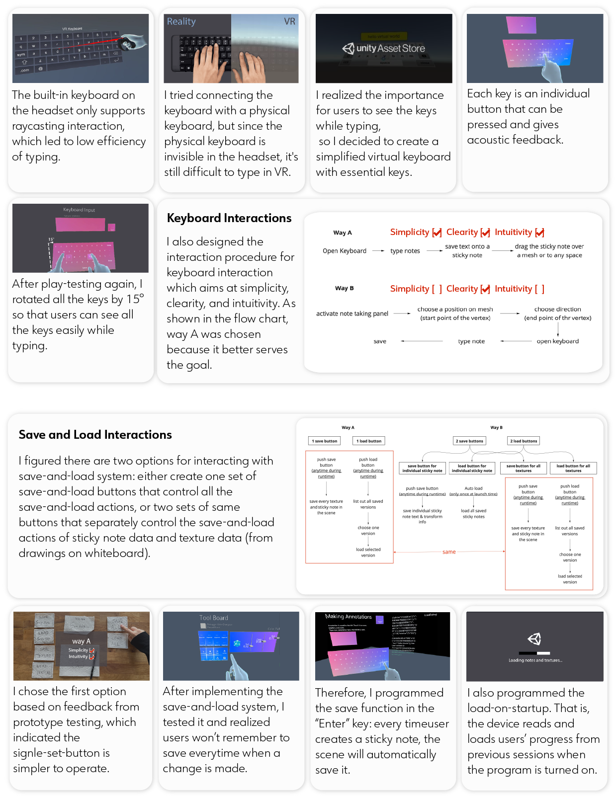

import StoryBlock from '../../../components/StoryBlock.astro';
import HorizontalBreak from '../../../components/HorizontalBreak.astro';

<HorizontalBreak isDivider={true}/>

<StoryBlock 
  section_name="Background Research"
  header="Why is this project important?"
  description="ECMO, Extracorporeal Membrane Oxygenation, is a technique for providing prolonged cardiac and respiratory support to persons whose heart and lungs are unable to provide an adequate amount of gas exchange or perfusion to sustain life. This technique requires specialized trained surgeons and assistants due to the requirements for critical decision-making ability under high-stress situations."
>

</StoryBlock>

<StoryBlock 
  section_name="Background Research"
  header="So I asked myself these questions..."
  description=" "
>

</StoryBlock>

<StoryBlock 
  section_name="Background Research"
  header="And learned about the challenges and opportunities:"
  description=" "
>

</StoryBlock>

<StoryBlock 
  section_name="Concept Development"
  header="I reframed the problems as..."
  description=" "
>

</StoryBlock>

<StoryBlock 
  section_name="Concept Development"
  header="Working with the team, I narrowed down to a solution"
  description="We decided to create a virtual classroom with the following features a whiteboard that can be written and draw on; a manikin that can be marked on and cut; a tool board that includes surgical tools, writing/drawing tool, and an expandable keyboard; a sticky note system than can be dragged, resized, rotated, edited, deleted, saved, and loaded; and a networking system that allows multiple users to join, talk, gesture, and interact with prompts."
>

</StoryBlock>

## Now it's time to build! 

<StoryBlock 
  section_name="Execution Process"
  header="Concept Design"
  description=""
>

</StoryBlock>

<StoryBlock 
  section_name="Execution Process"
  header="Dive in to iterating the VR interactions:"
  description=""
>

</StoryBlock>

## Here's the final product:

<StoryBlock 
  section_name=""
  header=""
  description=""
>
(coming soon: video demo)
</StoryBlock>

## Wrap-up

<StoryBlock 
  section_name="Wrap-up"
  header="Takeaways"
  description="This was an initial prototype scoped to only 3 months. In a future phase of the project, I would like to do play-tests on clinical professionals and get feedback from them. I also want to create a tutorial scene to direct new users in the environment. I will need to hear from testers with little experience in VR about what they need to get familiar and comfortable with our VR environment and interface."
>
</StoryBlock>
