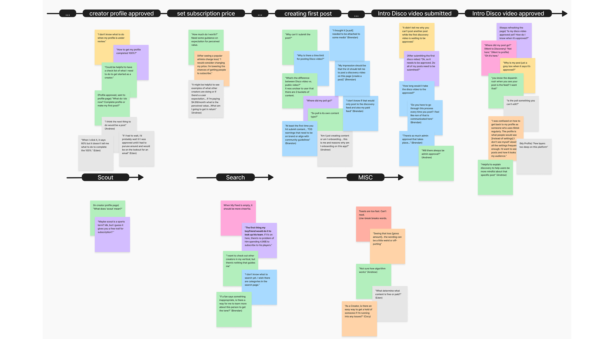
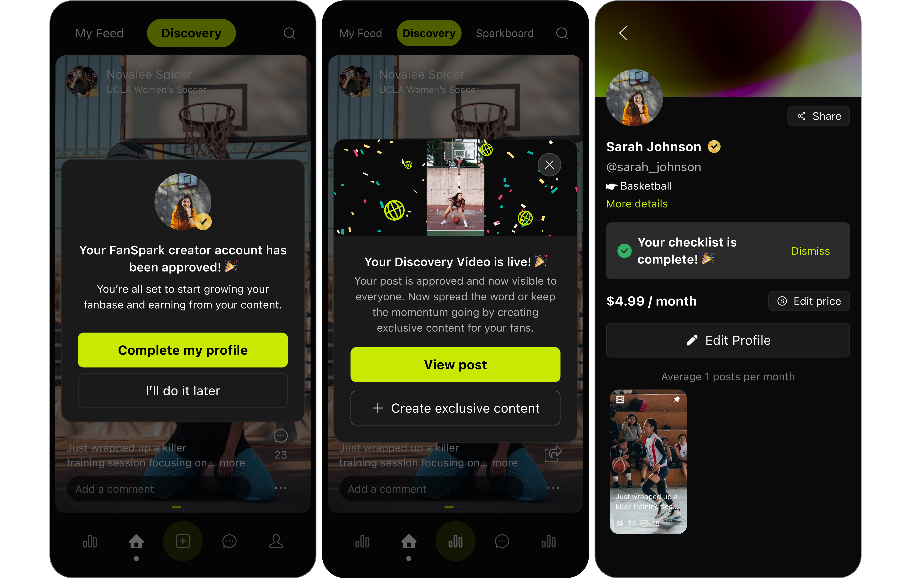

import StoryBlock from "../../../components/StoryBlock.astro";
import HorizontalBreak from "../../../components/HorizontalBreak.astro";

<StoryBlock
  section_name=""
  header="Impact"
  description={`Testing showed that this system enabled over <strong>90%</strong> of new creators to complete onboarding successfully within their first attempt. \n
  Bonus: The solution also established a reusable pattern that can be <strong>scaled easily</strong> to new product areas and user roles.`}
></StoryBlock>

<HorizontalBreak isDivider={true}/>

## Early version of onboarding drop-off was at 45%, undermining the platform's growth.

<StoryBlock
  section_name="Problem Framing"
  header="Business Need"
  description="FanSpark exists to help college athletes earn recurring revenue directly from their fans through subscriptions."
></StoryBlock>

<StoryBlock
  section_name=""
  header="Business Problem"
  description={`With <strong>45% </strong> of athletes <strong>abandoning onboarding</strong>, it translated directly into <strong>lost revenue</strong>: fewer creators launching meant fewer subscriptions, slowing the platform's overall growth.`}
></StoryBlock>

<StoryBlock
  section_name=""
  header="People Problem"
  description={`For athletes, the time and energy spent setting up a profile didn't feel <strong>worth the uncertain return</strong> — making them less motivated to invest in the platform.`}
></StoryBlock>

<StoryBlock
  section_name="Research"
  header="Validating the problem and gaining in-depth insights through research."
  description={`I validated the problem through <strong>survey, interviews, and usability testing </strong>, which confirmed that athletes needed to see value upfront and a clear path to monetization. To identify opportunities for improvement, I mapped pain points onto <strong>journey maps</strong> to visualize where friction happened and why.`}
>
  
</StoryBlock>

## Through research, several pain points were identified that contributed to user drop-offs:

<StoryBlock
  section_name=""
  header="Trust Barrier"
  description={`<strong>25%</strong> creators didn't trust the platform with their personal information -- users were reluctant to provide information upfront without seeing values.`}
></StoryBlock>

<StoryBlock
  section_name=""
  header="Lack of Context"
  description={`<strong>70%</strong> creators was not able to grasp the feature setup -- users were confused with the novelty concepts on the platform.`}
></StoryBlock>

<StoryBlock
  section_name=""
  header="Lack of Guidance"
  description={`<strong>90%</strong> creators don't know what to do after existing onboarding -- users struggled to take meaningful actions after signing up.`}
></StoryBlock>

## How might we help new users (athletes creators) see clear, tangible value from FanSpark so they’re motivated to adopt the new platform?

<StoryBlock
  section_name="Key Design Decisions"
  header={`Reduce barriers to reaching the <em>Aha!</em> moment where values are demonstrated`}
  description=""
>
   
</StoryBlock>

<StoryBlock
  section_name="Key Design Decisions"
  header={`Celebrate small wins`}
  description=""
>
  
</StoryBlock>

<StoryBlock
  section_name="Key Design Decisions"
  header={`Provide context without disturbing current task`}
  description=""
>

</StoryBlock>

<StoryBlock
  section_name="Key Design Decisions"
  header={`Making the next step explicit with milestone checklists`}
  description="To reduce uncertainty and keep creators motivated, I implemented a setup checklist that outlined the exact tasks needed. This guided structure gave creators confidence and a direct path to unlocking their first subscribers."
>

</StoryBlock>

## Early testing validated the design decisions:

<StoryBlock
  section_name=""
  header={`Over <strong>90%</strong> of new creators was able to complete onboarding successfully within their first attempt.`}
  description={``}
></StoryBlock>

<StoryBlock
  section_name=""
  header={`Bonus: the onboarding solutions was scalable to new product/user areas.`}
  description={``}
></StoryBlock>

## Next steps:

<StoryBlock
  section_name=""
  header={`Collect quant data through validate this update and spot further pain points.`}
  description={`To measure impact at scale, I partnered with the PM to map the onboarding funnel in <strong> Amplitude </strong> and track key metrics including <strong> drop-off </strong> and <strong> profile completion rates </strong>.`}
>
</StoryBlock>

## Learnings

<StoryBlock
  section_name=""
  header={`At 0→1, the breakthrough came when we put an imperfect version in front of users and let their feedback guide us.`}
  description={`At the start of this project, we had no active users and limited access to athletes, since the sales team was still building connections in a niche market. With no direct user data to guide design, I worked with the team to ship quickly and test early. We released an initial onboarding prototype built on assumptions — such as new users preferring a minimalist flow and maximum freedom to explore.\n
  By testing this early version before the platform's launch, we were able to invalidate some of those assumptions and uncover valuable insights. For example, new users actually wanted more guidance as they adapted to a new platform and learned unfamiliar tools.\n
  This approach let us redesign onboarding and launch with something that better met real needs.`}
></StoryBlock>

<StoryBlock
  section_name=""
  header={`User problems don't always mirror business problems; asking the right question that tackles both is the key to success.`}
  description={`Earlier in the ideation stage, I explored solutions that aligned with the business goal of generating revenue through freemium content — tools like advanced content creation, content scheduling, and rich interactions under posts. \n
  But through talking to athletes and creators, I learned that their frustrations were different — in this case, new users needed help adjusting to a new platform. Finding a solution that addressed both the user problem and the business need was the key to the success of this project.`}
></StoryBlock>

<StoryBlock
  section_name=""
  header={`System thinking is about solving the big puzzle with the fewest pieces.`}
  description={`When designing the onboarding experience for creators, I kept other user groups in mind: fans, team profile managers, athlete agents. When making decisions, I prioritized solutions that could extend across these groups with only small customizations. \n
  This system-thinking mindset helped team cut down development time and delivered a consistent experience that made onboarding complex profiles easier, while also driving smoother adoption and stronger conversion across the platform.`}
></StoryBlock>
